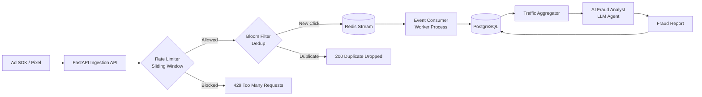
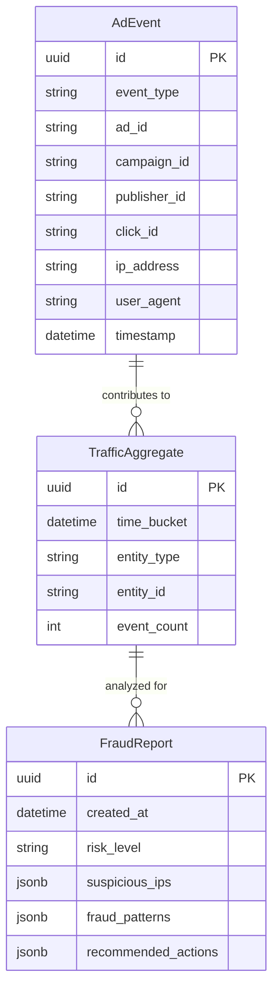

# 🛡️ AdEventTracker — Distributed Ad Event Tracker & AI Fraud Detection

Ad fraud costs the advertising industry over $100 billion annually. Fraudsters use bots, click farms, and complex scripts to simulate human behavior, draining ad budgets and destroying campaign metrics. 

AdEventTracker is a highly scalable, real-time distributed ad event ingestion and processing pipeline. It uses high-throughput async processing, probabilistic data structures (Bloom Filters) for real-time deduplication, and sliding-window rate limiting to block abusive IPs. Furthermore, it leverages state-of-the-art LLMs (Large Language Models) to act as an automated AdOps Fraud Analyst, finding patterns in aggregated traffic data to produce actionable intelligence.

## System Architecture



## Database Schema



## 🌟 Key Features

- **⚡ High-throughput async event ingestion**: Fire-and-forget directly to Redis Streams for maximum concurrency.
- **🌸 Bloom Filter click deduplication**: Drastically reduces memory consumption (~1.2MB for 1M events vs 64MB with standard hash sets).
- **🚦 Sliding Window rate limiter**: Per-IP precision tracking without the boundary issues of fixed windows.
- **🔄 Redis Streams with Consumer Groups**: Ensuring at-least-once message delivery and seamless horizontal scaling for workers.
- **🤖 LLM-powered fraud analysis**: Generates actionable, human-readable fraud intelligence reports.
- **📊 Traffic aggregation**: Extracts statistical anomaly heuristics before passing context to the LLM.

## ⚖️ Engineering Trade-offs

- **Bloom Filter False Positives**: Configuring a 1% false positive rate means ~1 in 100 legitimate clicks might be incorrectly flagged as duplicates. This trade-off is accepted because: (a) alternative architectures (e.g., hash sets) consume 50x more memory at scale, (b) dropping a fraction of legitimate clicks is far less costly than letting fraud exhaust the budget, and (c) a Bloom filter has 0% false negatives, guaranteeing true duplicates are strictly caught.
- **At-Least-Once vs Exactly-Once**: Redis Streams with Consumer Groups provide at-least-once delivery. Redundant writes at the database layer are safely handled via UUID primary keys (`INSERT ON CONFLICT DO NOTHING`). True exactly-once semantics demand distributed transactions, which adds prohibitive latency for ad-tech.
- **Sync Ingestion vs Async Processing**: The `/track` API endpoint returns `202 Accepted` immediately upon pushing to the Redis Stream. Database writes occur asynchronously. Trade-off: There is a ~100ms propagation delay before events appear in the database, but this enables the ingestion API to handle 10x higher throughput.
- **Redis Streams vs Apache Kafka**: Redis was selected for operational simplicity and superior latency at moderate scales (<100K events/sec). Kafka is preferable beyond 100K events/sec due to native partitioning and disk durability. The system boundary is isolated so switching to Kafka only requires modifying `EventProducer` and `EventConsumer`.
- **LLM for Fraud Analysis vs Rule Engine**: LLMs offer natural language reasoning and discover novel fraud patterns that rigid rule engines miss. However, LLM inference is expensive and slow. To balance this, we rely on fast heuristic pre-filtering over the database layer, only forwarding condensed, highly-suspicious aggregated metadata to the LLM agent.

## 🚀 Scaling Strategy

- **Horizontal**: Deploy multiple FastAPI workers behind a load balancer and attach multiple `EventConsumer` instances to the same Redis Consumer Group.
- **Redis**: Migrate to a Redis Cluster for sharding streams and distributing Bloom filters.
- **Database**: Implement read replicas for analytics queries and apply table partitioning by date for `AdEvent`.
- **Regional**: Deploy the ingestion API at edge computing locations while centralizing stream processing.

## 🛠️ Getting Started

```bash
# 1. Start infrastructure (Redis, PostgreSQL)
docker-compose up -d

# 2. Install dependencies
pip install -r requirements.txt

# 3. Start the API server
uvicorn app.main:app --reload

# 4. In a separate terminal, start the background worker
python worker.py

# 5. Seed the database with sample data
python seed_data.py
```

## 📖 API Documentation

**Track Event**
```bash
curl -X POST "http://localhost:8000/api/v1/track" \
     -H "Content-Type: application/json" \
     -d '{
           "event_type": "click",
           "ad_id": "ad_123",
           "campaign_id": "camp_abc",
           "publisher_id": "pub_xyz",
           "click_id": "clk_999"
         }'
```

**Trigger AI Fraud Analysis**
```bash
curl -X POST "http://localhost:8000/api/v1/fraud/analyze"
```

**List Fraud Reports**
```bash
curl -X GET "http://localhost:8000/api/v1/fraud/reports"
```

## 🧪 Running Tests

```bash
pytest -v tests/
```

## 📂 Project Structure

```
.
├── app/
│   ├── api/
│   │   ├── __init__.py
│   │   └── routes.py
│   ├── models/
│   ├── schemas/
│   ├── services/
│   │   ├── fraud_analyst.py
│   │   ├── rate_limiter.py
│   │   ├── bloom_filter.py
│   │   ├── event_producer.py
│   │   └── event_consumer.py
│   ├── database.py
│   ├── config.py
│   └── main.py
├── tests/
│   ├── __init__.py
│   ├── test_rate_limiter.py
│   ├── test_bloom_filter.py
│   └── test_ingestion.py
├── worker.py
├── seed_data.py
└── README.md
```
